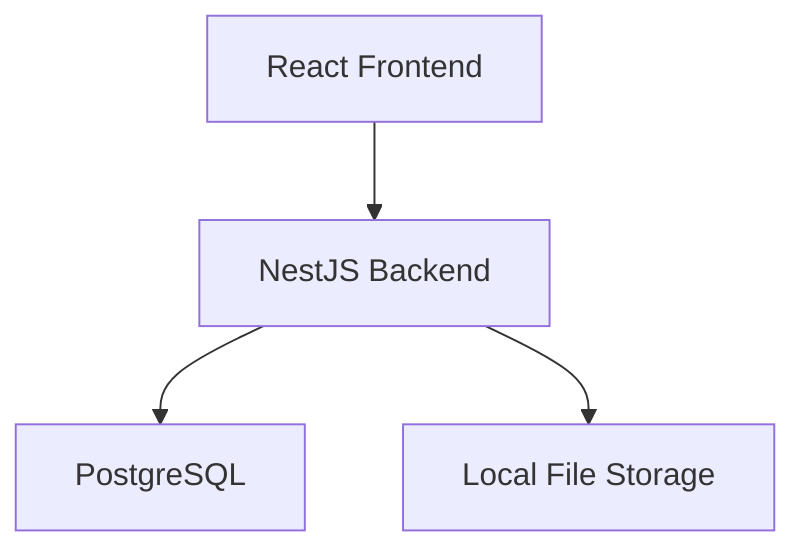

# Architecture – MVP

## High-Level Architecture

Frontend → Backend → Database + Local File Storage

## Stack

Backend:

NestJS

Database:

PostgreSQL

Frontend:

React

Authentication:

JWT

Role-based middleware

File Handling:

Files stored locally

File path stored in database

Deployment:

Hetzner production server

## Architectural Principles

Monolithic architecture

No microservices

No background workers

No event-driven design

No distributed systems

No cloud storage (MVP)

Keep it simple and deterministic.

## Frontend Application Structure

The React app uses React Router, Context API for auth, and role-based dashboard views.

### Routing

- `/login` – Login page (public)
- `/register` – Registration page (public)
- `/dashboard` – Main app (protected; requires authentication)
- `/` – Redirects to `/dashboard` (protected routes redirect unauthenticated users to `/login`)

### Key Directories and Files

- **pages/** – Login, Register, Dashboard
- **components/** – PrivateRoute (route guard), UserDashboard, BeneficiaryDashboard, BothRolesDashboard, ItemList, ItemCard, ItemForm
- **context/** – AuthContext (authentication state, token, role, login, register, logout)
- **services/** – api.js (axios instance, authAPI, itemsAPI, beneficiaryAPI)
- **utils/** – jwt.js (decode JWT, get role from token, check expiry)

### Role-Based UI

- **Role "user"** – UserDashboard: full CRUD on items (create, edit, delete, release).
- **Role "beneficiary"** – BeneficiaryDashboard: read-only list of released items (from GET /beneficiary/items).
- **Role "both"** – BothRolesDashboard: two sections — "My Vault" (editable) and "Accessible Items" (read-only), with tab or section switching.

### Backend Structure (NestJS)

- **auth/** – Registration, login, JWT generation, role resolution (user / beneficiary / both)
- **users/** – User entity and services
- **items/** – CRUD and release for vault items; file upload
- **beneficiaries/** – Beneficiary entity; link to users via user_beneficiaries
- **database/** – Entities, migrations, TypeORM/Prisma configuration

